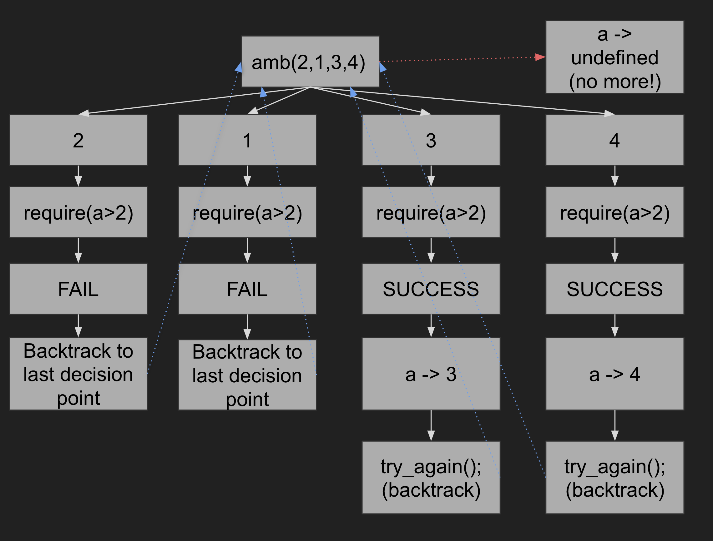

Source §2 Non-Det is a small programming language, designed for the fourth chapter
of the textbook
<a href="https://sicp.comp.nus.edu.sg">Structure and Interpretation
of Computer Programs, JavaScript Adaptation</a> (SICP JS).

## What is non-deterministic programming?
Source 2 Non-Det is a non-deterministic implementation of Source 2.

The following are the features:

- Automatic search
- Ambiguous function `amb()` which provides a list of possible values for the subsequent code
- An empty `amb()` gives out no choice, which implies a failure
- A systematic/random depth-first search of all possible values and backtrack to the most recent choice point that leads to failure of the program and tries the next alternative.


## What names are predeclared in Source §2 Non-Det?

On the right, you see all predeclared names of Source §2 Non-Det, in alphabetical
order. Click on a name to see how it is used.
  <ul>
    <li>
      <a href="../MISC/">MISC</a>: Miscellaneous constants and functions
    </li>
    <li>
      <a href="../MATH/">MATH</a>: Mathematical constants and functions
    </li>
    <li>
      <a href="../LISTS/">LISTS</a>: Support for lists
    </li>
  </ul>

## What can you do in Source §2 Non-Det?

You can use all features of
<a href="../source_2/">Source §2</a>, and all
features that are introduced in
<a href="https://sicp.comp.nus.edu.sg/chapters/85">chapter 4.3</a> of the
textbook.

Below are the features that Source §2 Non-Det adds to Source §2.

### amb()

You can provide a list of alternatives using `amb()`.

For example `amb(2,1,3,4)` will give the `2` at first run, then the subsequent call to it will give `1`...

Once all alternatives are exhausted, `undefined` will be returned,

### Functions that can be implemented by `amb()`

`require` constraints the program, the condition must be met to proceed.
```js
function require(p) {
    return ! p ? amb() : "some ordinary value";      
}
```

`distinct` constraints a list, all elements in the list must be different from each other.
```js
function distinct(items) {	
    return is_null(items) 
        ? true
        : is_null(tail(items))
          ? true
          : is_null(member(head(items), tail(items)))
            ? distinct(tail(items))
            : false;
}
```

More interesting customized constraints can be implemented by using other constraint function like `require`.
```js
function greater_than(num, baseline){
  return require(num > baseline);
}
```

## An illustration 

```js
const a = amb(2,1,3,4);
require(a>2);
a;
```




## You want the definitive specs?

For our development team, we are maintaining a definitive description
of the language, called the
<a href="../source_2_nondet.pdf">Specification of Source §2 Non-Det</a>.
Feel free to take a peek!
