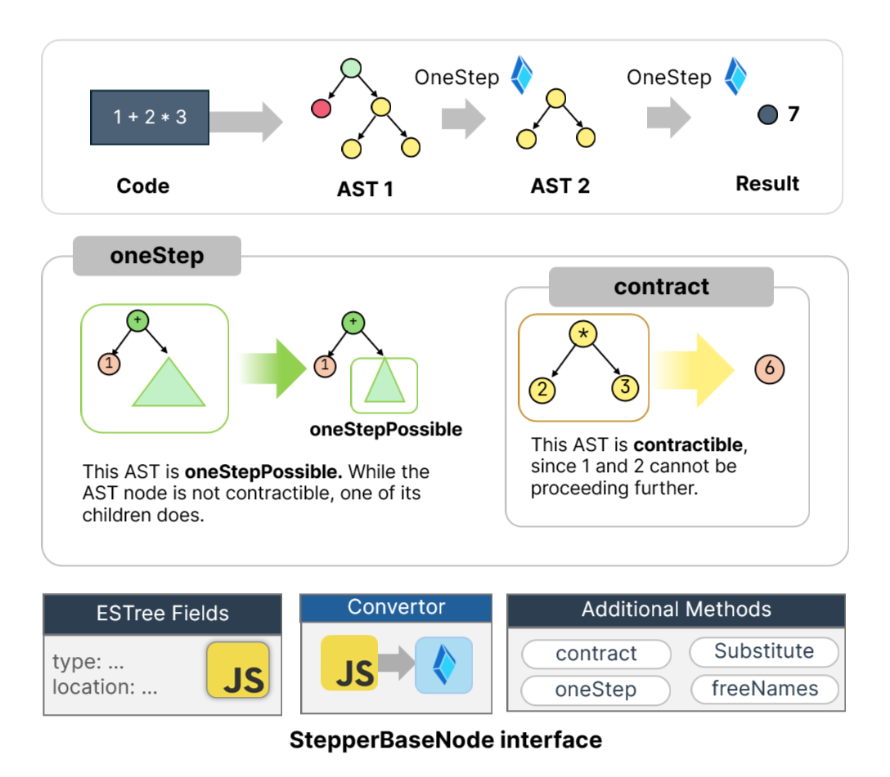

# Stepper Documentation

<!-- @import "[TOC]" {cmd="toc" depthFrom=1 depthTo=6 orderedList=false} -->

<!-- code_chunk_output -->

- [Stepper Documentation](#stepper-documentation)
  - [Quickstart](#quickstart)
  - [High-level implementation details](#high-level-implementation-details)
    - [Expression stepper](#expression-stepper)
    - [Statements](#statements)
    - [Constant declaration](#constant-declaration)
    - [Functions](#functions)
    - [Alpha renaming](#alpha-renaming)
  - [Augmenting functionalities](#augmenting-functionalities)
    - [Entry point](#entry-point)
    - [Generating explanations](#generating-explanations)
    - [Some important decisions](#some-important-decisions)
      - [Builtin math functions](#builtin-math-functions)

<!-- /code_chunk_output -->

## Quickstart

First of all, make sure that you have already installed `js-slang` using `yarn`. There are many possible ways that you can work and test the code. One of my personal solution is using `yarn test`. During the development, you can edit the file from `../__test__/tracer_debug.ts` and run it with the following command:

```bash
yarn test -- tracer_debug.ts  > testOutput.log
```

Note that the flag `--silence=false` is set in order to see the output from `console.log`. In order to fully test the stepper, you can execute the following command.

```bash
yarn test -- tracer_full.ts
```

## High-level implementation details

Our stepper is a program that reduces a piece of code to its simplest form until it can no longer be reduced. While the idea sounds abstract, the step-by-step reduction of code allows us to add explanations, further aiding student learning when they want to scrutinize how the code is evaluated. The method is formally defined as beta reduction.

### Expression stepper

In order to implement the program with such functionalities, we have to first parse the program string into certain structure that we can approach to, so-called Abstract Syntax Tree (AST). For instance, string `2 * 3` can be converted to AST as `BinExp[* Lit[2] Lit[3]]`, where `BinExp` is a binary expression node consisting of two literals `2` and `3` combined with operator `*`. Note that our programming language consists of various node types, it's difficult to implement a parser from scratch to cover all cases. Luckily, the library `acorn` helps us generate the AST from a piece of string which is very convenient.

Here comes the fun part. How are we supposed to evaluate `BinExp[* Lit[2] Lit[3]]`? Since we cannot do anything further, we just simply **contract** them to `Lit[6]` and we are done. However, consider the AST `BinExp[* Lit[2] BinExp[+ Lit[3] Lit[4]]]` generated from `2 * (3 + 4)`, if we contract this expression directly, we will get `2 * {OBJECT}` which is not computable since one of the operands is not a number. Hence, we have to contract `BinExp[+ Lit[3] Lit[4]]]` first before contracting the outer `BinExp`.  Note that our stepper only contracts one node for each step. This is our main constraint that we use during the implementation.



To implement this, we should have two methods `oneStep` and `contract` to perform this reduction. In addition, we also have another two methods `oneStepPossible` and `isContractible` to safeguard our AST before actually proceeding with our reduction procedure.

- `isContractible: StepperBaseNode => boolean` returns true if all of its children cannot be proceed further (`oneStepPossible` is false).
- `oneStepPossible: StepperBaseNode => boolean` returns true if the AST can be proceed further.
- `oneStep: StepperBaseNode => StepperBaseNode` either perform `contract` if the AST is contractible or performing `oneStep` on child nodes.
- `contract: StepperBaseNode => StepperBaseNode` contracts the AST.

These methods can be applied for all types of AST nodes, such as expressions, statements, and program. The details about  `StepperBaseNode` are discussed in [this](#augmenting-functionalities) section.

### Statements

Each program consists of one or more statements. Consider the simplest case where every statement is an expression statement.

```ts
1 + 1;
2 + 3;
4 + 5;
```

Initially, our stepper must reduce the first two statements while keeping the second statement. For each expression statement, the simplest form where the statement contains literal value is called _value statement_ (e.g. `2;`).

```ts
1 + 1; 2 + 3; 4 + 5;
2; 2 + 3; 4 + 5;
2; 5; 4 + 5; // First two statements are value statements
5; 4 + 5; // first value statement is ignored
5; 9; // Now, the first two statements are value statements 
9; // second statement is kept
```

Not all statements, however, are value-inducing. For instance, constant declaration statement `const x = 1;` and function declarations do not produce value. Here, we assume that non-value inducing statements will be reduced to `undefined;` (an expression statement containing literal value `undefinedNode`). The fix is really simple; we just ignore it during the search for the first two statements.

```ts
const x = 1; 1 + 1; const y = 3; 1 + 5;
1 + 1; const y = 3; 1 + 5; 
2; const y = 3; 1 + 5; // we got our first value statement
2; 1 + 5; // ignore the non-value inducing
2; 6;
6; // second value statement is kept.
```

If there is no value inducing statement, we simply output `undefined';`

```ts
const x = 1;
undefined; // after substituting x
```

Note that the `oneStep` method determines which child nodes will be contracted. You can check the implementation of `oneStep` in `nodes/Program.ts` for more details.

### Constant declaration

To be updated

To make sure that the substituted variable has not been declared in the scope, we can simply check whether the variable name is in the list generated by `scanAllDeclarationNames()`.

```ts
scanAllDeclarationNames(): string[] {
    return this.body
      .filter(ast => ast.type === 'VariableDeclaration' || ast.type === 'FunctionDeclaration')
      .flatMap((ast: StepperVariableDeclaration | StepperFunctionDeclaration) => {
        if (ast.type === 'VariableDeclaration') {
          return ast.declarations.map(ast => ast.id.name)
        } else {
          // Function Declaration
          return [(ast as StepperFunctionDeclaration).id.name]
        }
      })
  }
```

### Functions

To be updated

### Alpha renaming

To be updated

## Augmenting functionalities

Since our stepper takes AST (of any types) as an input and recursively navigate along the tree to find the next node to contract. There are many functionalities that we have to perform on each AST (such as contracting the AST as discussed in the previous section). Intuitively, we should add these functionalities as methods for each of the AST classes. Since the AST obtaining from the library is an `ESTree` interface, we have to implement our own concrete classes inherited from the ESTree AST Nodes. We also have to create our own convertor to convert the former ESTree into our own Stepper AST:

```typescript
// interface.ts
export interface StepperBaseNode {
  type: string
  isContractible(): boolean
  isOneStepPossible(): boolean
  contract(): StepperBaseNode
  oneStep(): StepperBaseNode
  substitute(id: StepperPattern, value: StepperExpression): StepperBaseNode
  freeNames(): string[]
  allNames(): string[]
  rename(before: string, after: string): StepperBaseNode
}
```

Conversion from `es.BaseNode` (AST interface from `ESTree`) to `StepperBaseNode` is handled by function `convert` in `generator.ts`.

```typescript
// generator.ts
const nodeConverters: { [Key: string]: (node: any) => StepperBaseNode } = {
  Literal: (node: es.SimpleLiteral) => StepperLiteral.create(node),
  UnaryExpression: (node: es.UnaryExpression) => StepperUnaryExpression.create(node),
  BinaryExpression: (node: es.BinaryExpression) => StepperBinaryExpression.create(node),
  // ... (omitted)
}

export function convert(node: es.BaseNode): StepperBaseNode {
  const converter = nodeConverters[node.type as keyof typeof nodeConverters]
  return converter ? converter(node as any) : undefinedNode
  // undefinedNode is a global variable with type StepperLiteral
}
```

### Entry point

The starting point of our stepper is at `steppers.ts` with the function `getSteps`. This function is responsible for triggering reduction until it cannot be proceed. The result from our evaluation is then stored in array `steps`. Here is the shorten version of `getSteps`.

```typescript
export function getSteps(node: StepperBaseNode) {
  const steps = []
  function evaluate(node) {
    const isOneStepPossible = node.isOneStepPossible()
    if (isOneStepPossible) {
      const oldNode = node
      const newNode = node.oneStep() // entry point
      // read global state redex and add them to steps array
      return evaluate(newNode) 
    } else {
      return node
    }
  }
  evaluate(node)
  return steps
}

```

In order to keep track of the node that is reduced (i.e., the node highlighted in orange and green in the current SICP stepper), we use the global state redex to track all nodes that should be highlighted. This state is then updated dynamically during the contraction process.

```typescript
export let redex: { preRedex: StepperBaseNode[]; postRedex: StepperBaseNode[] } = {
  preRedex: [],
  postRedex: []
}
// How to use global state
redex.preRedex = [node]
const ret = someSortOfReduction(node)
redex.postRedex = [ret]
```

### Generating explanations

Explanations are generated based on `preRedex`. We use the same approach with the convert function. We have several dispatchers corresponding to each of the AST types. The implementation of `explainer` is in `generator.ts`.

### Some important decisions

There are some design decisions that diverge from the original Source 1 and 2. Here are some changes we have made.

#### Builtin math functions

Calling math function with non number arguments is prohibited in stepper.

```ts
// Test Incorrect type of argument for math function
math_sin(true); // error!
```
